# 
 ETL Project 

# 
Biodiversity & National parks

Team -- Ashley Patterson, Mrinalini Darswal

Data source: https://www.kaggle.com/nationalparkservice/park-biodiversity

# 
<b>Extract

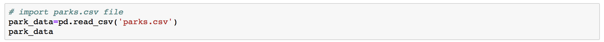
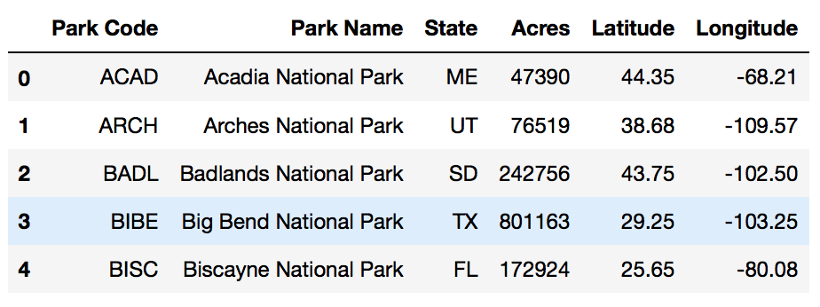

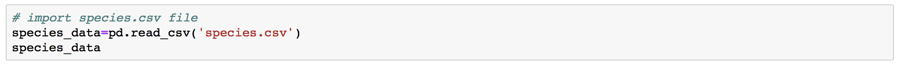
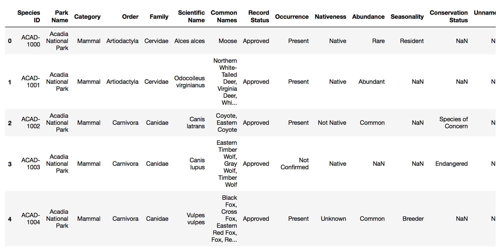

# 
<b>Transform

 #### 
Use Pandas to join the two datasets by Park Name
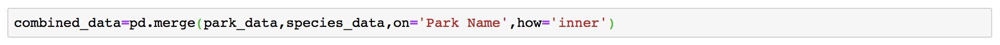

 #### 
<b> Find which columns have missing values 
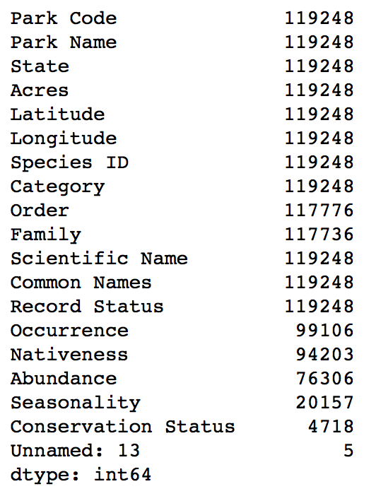

#### 
 Remove columns that have null values. 
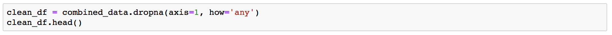
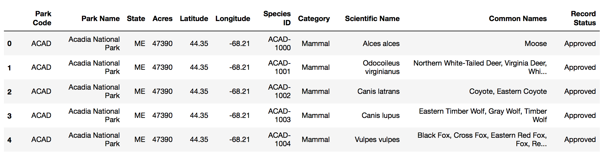

# 
<b> Old and busted
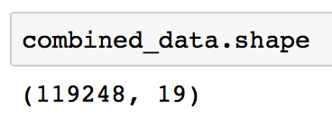

# 
<b> New hotness
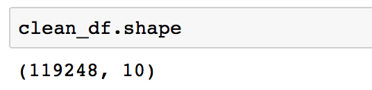

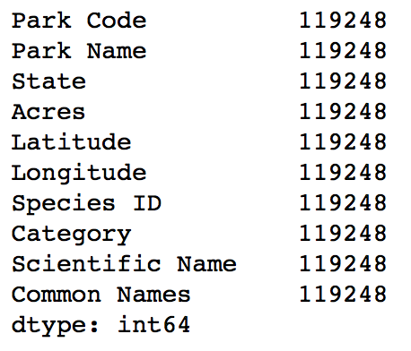

 

# 
<b>Load

 

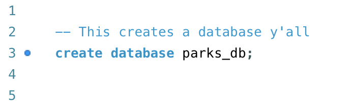

## 
<b> Connect to local database

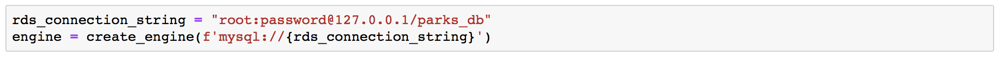

## 
<b> Use pandas to load csv converted DataFrame into database

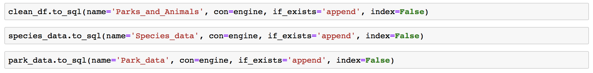

## 
<b>Confirm data has been added by querying the customer_name table

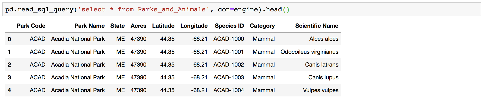

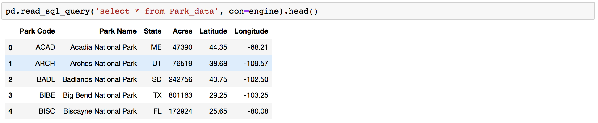

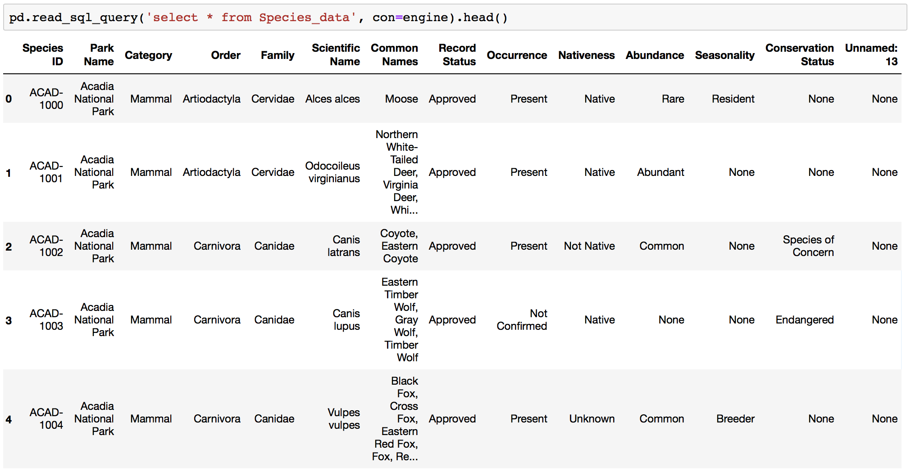

 

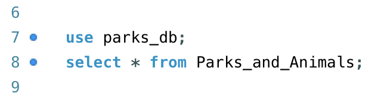

 

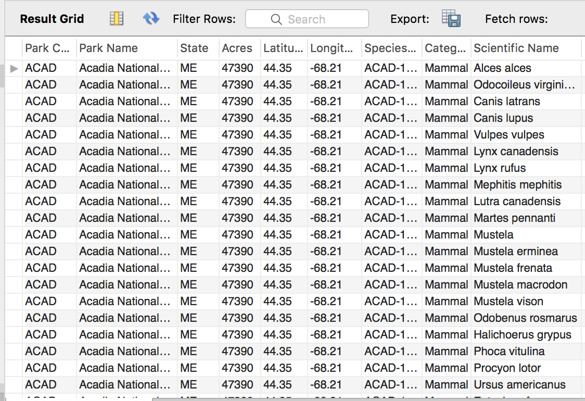
